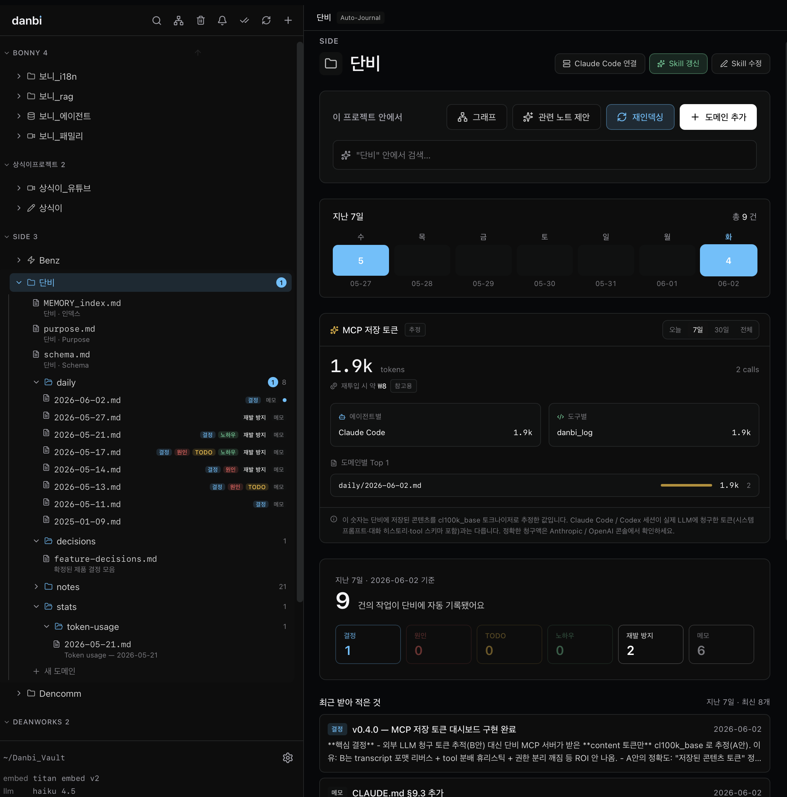
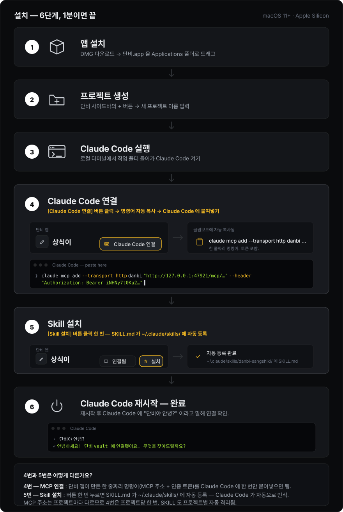

<p align="center">
  
</p>

<p align="center">
  
</p>

<p align="center">
  Claude Code · Codex 같은 AI 와 함께 자라는 나만의 연구실.<br/>
  macOS 데스크톱 앱. 모든 데이터는 로컬에. AI 키 없이도 80%, 키 한 줄로 100%.
</p>

<p align="center">
  <a href="https://github.com/dean-studio/danbi/releases/latest"></a>
  <a href="https://github.com/dean-studio/danbi/releases"></a>
  
  
</p>

---




## 한 마디로
세 가지 도구가 표면상 비슷해 보이지만 정체성이 다릅니다:

- **옵시디언** — 사용자가 vault 의 주인. 직접 채우고 직접 연결.
- **Raycast** — 사용자가 명령의 주인. 도구로 가는 통로.
- **단비** — **AI 가 vault 의 주인이고, 사용자가 그 결과를 정밀하게 통제**.

단비는 Claude Code · Codex · Cursor 같은 외부 AI 에이전트가 vault 를 직접 읽고 쓰도록 MCP 서버를 내장합니다. 사용자가 단비 앱을 안 열어둬도 AI 가 일하는 동안 vault 는 알아서 쌓이고 검색됩니다.

## 핵심 가치

- 🟡 **LLM API 키가 필수가 아니에요** — 추론은 외부 AI 가 자기 환경에서. 단비는 의미 검색·자동 요약 같은 옵션 기능을 켤 때만 키를 받습니다.
- 🔵 **MCP 서버 내장** — Claude Code · Cursor 가 vault 를 직접 읽고·씁니다. 단비가 외부 AI 의 공유 뇌가 됩니다.
- 🟢 **데이터는 Mac 에만 머물러요** — 모든 vault 파일은 로컬에 저장되고, git 으로 자동 버전 관리됩니다.

---

## 설치 방법


## 원리 — 친구에게 설명하듯이

ChatGPT · Claude 같은 AI 와 작업해본 적 있다면 이 답답함을 아실 거예요:

> "어제 우리 이거 어떻게 하기로 했더라?" → AI: *"저는 이전 대화를 기억하지 못합니다."*

AI 는 **새 대화창을 열 때마다 기억을 잃습니다.** 그래서 매번 같은 설명을
처음부터 다시 해줘야 하고, 그 설명이 **곧 비용** 이에요. 메시지가 길수록
요금이 올라가니까요.

**단비는 AI 의 외장 메모리** 라고 생각하시면 됩니다.

```
당신 ──▶ AI (Claude, Cursor 등) ──▶ 단비 ──▶ 노트 파일 (Mac 안에)
                  ▲                    │
                  └────────────────────┘
                  필요한 것만 꺼내서 보여줌
```

작동 순서는 이렇게 단순합니다:

1. **당신이 AI 에게 묻습니다** — "어제 결정한 거 다시 알려줘"
2. **AI 가 단비에게 부탁합니다** — "이 사람이 어제 뭐 했는지 찾아줘"
3. **단비가 노트 더미에서 관련 부분만 추려서 줍니다** — 책 한 권 통째로
   주는 게 아니라 **딱 필요한 페이지 한두 장만**
4. **AI 가 그걸 보고 답합니다** — 답하면서 새로 결정한 내용도 단비에게
   "기록해 둬" 라고 부탁
5. **다음 날 새 대화창을 열어도 단비가 다 기억하고 있습니다** ✨

### 사이드 프로젝트 여러 개 굴리는 사람에게 특히 유용해요

회사 일 + 사이드 프로젝트 2~3개를 동시에 굴리는 분들이라면 이런 경험 있으실 거예요:

- A 프로젝트 작업하다가 갑자기 B 프로젝트 노트 내용이 AI 답변에 섞여 나옴 😵
- "어제 어느 프로젝트에서 그 결정 했더라?" 헷갈림
- 프로젝트가 늘수록 AI 가 점점 산만해짐

**단비는 프로젝트(또는 그룹)마다 완전히 독립된 주소를 줍니다.**

```
~/.claude/skills/danbi-bonny/        ← 보니 프로젝트 전용 (포트 47921/bonny)
~/.claude/skills/danbi-sangshiki/    ← 상식이 프로젝트 전용
~/.claude/skills/danbi-side-blog/    ← 블로그 사이드 전용
```

Claude Code · Cursor 에서 보니 프로젝트 폴더로 들어가면 **보니 노트만**
보입니다. 상식이 노트는 아예 시야에 없으니:

- ✅ 다른 프로젝트의 내용이 답변에 섞일 일 0
- ✅ 한 프로젝트만 보내니까 컨텍스트가 짧아져 **토큰 또 절약**
- ✅ 프로젝트별로 깔끔하게 누적 — 1년 뒤에도 "보니 1년 전 오늘" 회고 가능

설치도 한 번에 끝납니다 — 사이드바에서 프로젝트 우클릭 → **"Claude Code
설치 명령 복사"** → 터미널에 붙여넣기. 그 폴더에서 Claude Code 를 켜면
끝.

### AI 가 단비에게 부탁할 수 있는 일들

연결만 해두면 Claude Code · Cursor 가 자동으로 적절한 도구를 골라 씁니다.
사용자가 직접 명령어를 외울 필요는 없지만, 대략 어떤 일을 시킬 수 있는지
보면 감이 옵니다.

#### 📖 읽기 (vault 안 어디든 조회)

| 도구 | 일상어로 말하면 |
|---|---|
| `danbi_briefing` | "오늘 시작할 때 어디서부터 이어 하면 돼?" — 최근 활동·TODO·1주/1달/1년 전 노트를 한 번에 요약 |
| `danbi_recent` | "최근에 뭘 만졌더라?" — 최근 수정한 노트 목록 |
| `danbi_search` | "지난번에 JWT 결정한 거 어디 적었지?" — 키워드/자연어 검색 (한국어 OK) |
| `danbi_read` | "그 노트 전체 내용 보여줘" — 특정 파일 그대로 |
| `danbi_daily` | "1년 전 오늘 뭐 했지?" — 오늘 + 어제 + 1주/1달/1년 전 daily 노트 |
| `danbi_list_projects` | "다른 프로젝트들엔 뭐가 있더라?" — vault 전체 트리 |

#### ✍️ 쓰기 (각 프로젝트로 자동 격리됨)

| 도구 | 일상어로 말하면 |
|---|---|
| `danbi_log` | "이거 오늘 일지에 적어둬" — 오늘 daily 노트에 한 줄 추가 |
| `danbi_append` | "이건 auth 노트에 붙여줘" — 특정 도메인 파일에 추가 (없으면 새로 생성) |
| `danbi_create_folder` | "이 프로젝트 안에 stats 폴더 만들어줘" — 프로젝트 안 1단계 sub-folder 생성 |

> 쓰기 도구는 **그 endpoint 의 프로젝트로 자동 고정** 됩니다. 즉,
> 보니 폴더에서 켠 Claude Code 가 실수로 상식이 프로젝트에 메모를 남길
> 일은 구조적으로 없습니다.

이 도구들 덕분에 Claude Code 와의 대화가 이런 식으로 흘러갈 수 있어요:

> **나:** "어제 토큰 만료 어떻게 정했지?"<br/>
> **Claude:** *(`danbi_search` 호출)* "JWT refresh 7일로 정하셨네요.
> 이유는 모바일 세션 유지 vs 보안 트레이드오프 때문이고, 관련 노트는
> `notes/auth-security.md` 에 있습니다."<br/>
> **나:** "맞아. 오늘은 refresh 토큰 회전 로직 짜자. 결정 사항 기록해줘."<br/>
> **Claude:** *(`danbi_log` 호출)* "기록 완료. 내일 새 세션에서도 이어
> 보실 수 있어요."

### 왜 이게 돈을 아껴주나요?

AI 요금은 *대화에 들어간 글자 수* 로 계산됩니다.

- 단비 없이: 매번 "내 프로젝트는 이런 거고요, 어제 이런 결정을 했고요…"
  를 다 적어줘야 함 → **글자 수 폭발 → 요금 폭발**
- 단비 있으면: AI 가 단비에게 "어제 결정만 보여줘" 라고 하면
  단비가 **딱 그 부분만** 골라서 줌 → **글자 수 1/3 → 요금 1/2**

### 왜 단비가 빠르게 찾아줄 수 있나요?

도서관 사서가 색인 카드로 책을 찾듯, 단비도 **노트마다 미리 색인** 을
만들어 둡니다. 그래서 노트가 1만 개가 있어도 0.1초 안에 찾아냅니다.
(이 색인은 인터넷 없이 Mac 안에서 만들어지니 **공짜이자 빠릅니다**.)

### 그럼 AI 키가 꼭 있어야 하나요?

**아니요.** 단비는 AI 가 *아닙니다*. 그냥 **AI 의 노트장 + 검색 도우미**
역할만 합니다. 추론 (생각하기) 은 Claude Code · Cursor 같은 AI 가 자기
환경에서 합니다. 그래서 단비는:

- AI 키 없이도 마크다운 에디터 + 검색 + 그래프 등 **80% 가 작동**
- 키를 넣어도 그 키는 **당신 Mac 의 키체인에만** 저장. 단비 서버로 절대
  안 보냄.
- 노트도 전부 **당신 Mac 안에** 있고, git 으로 자동 백업됨.

---

## 왜 단비? — 토큰을 아끼고, 컨텍스트가 죽지 않는 이유

LLM 과 일하면서 가장 비싼 건 매번 같은 맥락을 다시 설명하는 일입니다.
단비는 *맥락을 vault 에 적어두고, 필요한 조각만 꺼내 던지는* 4단계로 그
비용을 깎습니다.

### 1️⃣ 프로젝트마다 독립된 MCP endpoint + SKILL

프로젝트를 만들면 단비가 자동으로:

- 그 프로젝트 전용 **MCP endpoint** 를 띄우고
- 그 프로젝트 전용 **SKILL.md** 를 `~/.claude/skills/danbi-<slug>/` 에 설치합니다

Claude Code · Cursor 는 이 endpoint 에 붙어서 *해당 프로젝트만* 읽고·씁니다.
다른 프로젝트의 노이즈가 컨텍스트에 섞이지 않으니, 매 턴 보내는 토큰이
줄어듭니다.

### 2️⃣ 세션 컨텍스트가 리셋돼도 단비가 기억합니다

LLM 의 컨텍스트 윈도우는 새 세션마다 비워집니다. 단비 vault 는 영속이고,
중요한 결정·버그 원인·TODO 가 매번 `danbi_log` 로 daily 노트에 누적됩니다.

> 다음 날 Claude Code 가 새로 켜져도 → `danbi_briefing` 한 번 →
> "어제 무슨 결정 했고, 어디까지 했고, 다음 무엇을 해야 하는지" **즉시 회복**.

긴 시스템 프롬프트로 매번 복기시키지 않아도 되니, 첫 턴부터 토큰이 짧습니다.

### 3️⃣ BM25 + 한국어 n-gram 검색 = 가장 큰 토큰 절약

큰 vault 를 통째로 LLM 에 넣으면 비싸고 느립니다. 단비는 [tantivy](https://github.com/quickwit-oss/tantivy)
기반 BM25 + 한국어 n-gram 인덱스로:

- 수백만 글자 vault → 관련 청크 8개만 추려서 LLM 에 전달
- 별도 임베딩 인덱스 / 비용 없음 — **로컬에서 즉시**
- AI 가 "X 결정 어떻게 했지?" 라고 물으면 단비가 8KB 정도만 던지고 답이 옵니다

### 4️⃣ (옵션) Gemini embedding 으로 의미 검색까지

`gemini-embedding-001` 은 **무료**. 한 번 등록하면 단비가 BM25 결과와 의미
검색 결과를 [RRF 하이브리드](https://en.wikipedia.org/wiki/Reciprocal_rank_fusion)
로 합쳐서 던집니다.

- "JWT 결정" 검색 → "토큰 만료 정책" 같은 동의어 노트까지 잡힘
- 동의어를 찾기 위해 LLM 을 부르지 않으니 검색 비용 0

### 📊 실제로 얼마나 아끼나 — 오늘 하루 측정 (2026-05-21)

같은 사람이 같은 노트북에서 하루 동안 작업한 26개 대화 세션을 두 묶음으로
나눠봤어요:

- 🟢 **단비를 쓴 대화 (2개)** — Claude Code 가 단비 vault 에서 맥락을 꺼내 답함
- ⚪ **단비를 안 쓴 대화 (24개)** — 매번 처음부터 맥락을 적어서 보냄

(같은 사람, 같은 컴퓨터, 같은 Claude Opus 4.7 모델. 작업 종류만 다름.)

대화 1턴 (= 한 번 묻고 한 번 답하는 것) 당 평균을 비교하면:

| 1턴 평균 | 🟢 단비 사용 | ⚪ 단비 미사용 | 차이 |
|---|---:|---:|---|
| 보낸 글자 (입력 토큰) | 적게 | 많게 | **단비 쪽이 1/2.5** |
| 답 받기까지 걸린 시간 | 약 41초 | 약 1분 10초 | **42% 빨라짐** |
| 1턴당 비용 | 절반 | 두 배 | **비용 절반** |

> 쉽게 말해: **같은 일을 시켜도 단비 쓰면 절반 비용 · 절반 시간**. 단비가
> "필요한 부분만 골라서" AI 에게 주기 때문이에요.

직접 자기 환경에서 재현해보고 싶다면 `scripts/token-stats.py` 실행. 결과는
`Vault/Projects/단비/stats/token-usage/<날짜>.md` 에 누적됩니다.

**핵심:** 단비 자체는 AI 를 호출하지 않습니다 (= 단비 쓴다고 추가 요금
없음). 토큰이 줄어드는 이유는 외부 AI (Claude Code 등) 에게 vault 의
*필요한 조각만* 골라 주기 때문입니다.

---

## 기능

### 키 0개로도 되는 것

- 마크다운 에디터 (BlockNote)
- BM25 + 한국어 n-gram 키워드 검색
- 그래프 뷰 (Louvain community + ghost suggestions)
- Wiki-link 클릭 (`[[notes/foo.md]]` ↔ 다른 도메인)
- Quick Capture (⌃Space) — 글로벌 단축키로 어디서든 메모
- 프로젝트별 MCP endpoint + SKILL 파일 자동 생성
- Git 자동 커밋 (저장 = 커밋)
- 휴지통 (30일 자동 만료)
- daily 노트 + Reminiscence (1주·1달·1년 전)

### AI 연동 켜면 추가

옵션 — Google Gemini API 키 (무료) 또는 AWS Bedrock (자격증명 자동 감지) 한 번 등록하면:

- **의미 검색** — RRF 하이브리드. "JWT 결정" 검색 → "토큰 만료 정책" 같은 동의어 문서까지
- **자연어 질의** — Claude Code 가 자연스러운 문장으로 vault 탐색해도 정확
- **Daily 노트 요약 + HTML 추출** — 한 클릭으로 카드형 공유 페이지
- **purpose / schema 자동 작성** — vault 의 다른 노트들 grounding 으로 자동 채움
- **관련 노트 제안 (ghost links)** — vault 가 알아서 연결을 제안

LLM 자동화는 모두 사용자 명시 트리거만 — 백그라운드 자동 호출 없음. 진행은 화면 우상단 toast + 사이드바 + 종 아이콘 알림 셋 다에서 노출.

## 설치

1. [Releases](https://github.com/dean-studio/danbi/releases) 에서 최신 `Danbi_*.dmg` 다운로드 (Apple Silicon)
2. DMG 더블클릭 → `단비.app` 을 Applications 폴더로 드래그
3. Launchpad 에서 단비 실행 → 4단계 마법사 (Welcome → AI 연동 → Vault → Template)

요구사항: macOS 11+ (Apple Silicon — Intel 빌드는 추후)

## 첫 1분

상세 가이드는 [docs/MCP_GUIDE.md](docs/MCP_GUIDE.md) 에. 요약:

1. 첫 프로젝트 만들기 (사이드바 +)
2. 사이드바에서 프로젝트 우클릭 → "Claude Code 설치 명령 복사"
3. 터미널에 붙여넣기
4. 이제 Claude Code 에 "단비 vault 에 기록해줘" / "X 프로젝트 보고 답해줘" 시킬 수 있음

## 자주 쓰는 단축키

| 단축키 | 동작 |
|---|---|
| ⌃Space | Quick Capture |
| ⌘K | 검색 |
| ⌘G | 그래프 |
| ⌘, | 설정 |
| ⌘S | 저장 |
| ⌘F | 노트 안 검색 |

## 기술

- Tauri v2 (Rust 백엔드 + macOS native)
- Vite + React + TypeScript + Tailwind + shadcn/ui
- BlockNote 에디터
- tantivy BM25 검색
- 자체 JSON 벡터 스토어 + Gemini / Bedrock embedding
- MCP HTTP 서버 (axum) + 프로젝트별 scoped endpoint
- Git 기반 vault 버전 관리

## 문서

- [INTRO.md](docs/INTRO.md) — 단비란 무엇인가, 왜 만들었나
- [MCP_GUIDE.md](docs/MCP_GUIDE.md) — Claude Code · Cursor 연결, 도구 목록, 실전 워크플로
- [REST_API.md](docs/REST_API.md) — vault 에 직접 쓰는 HTTP API (옵시디언 Local REST API 호환 패턴)
- [CHANGELOG.md](CHANGELOG.md) — 버전별 변경 이력

## 빌드 (개발자)

```bash
# 개발 모드
pnpm install
pnpm tauri dev

# DMG 빌드 (Apple Developer 인증서 필요)
pnpm bundle
```

## 라이선스

© 2026 [Dean Works inc.](https://dean.kr) — All rights reserved.

소스 코드 열람 목적으로 공개합니다. 다음 행위는 허용되지 않습니다:

- 코드 또는 자산의 복제 · 재배포 · 수정 후 배포
- fork 후 자체 빌드물의 공개 배포
- 상업적 사용 또는 파생 제품 제작

버그 리포트 · 토론 · pull request 는 환영합니다. 라이선스 정책은 향후
별도 LICENSE 파일로 명시될 수 있습니다.
